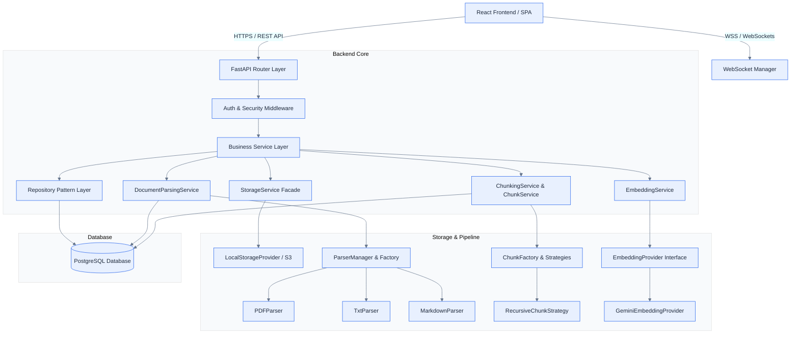
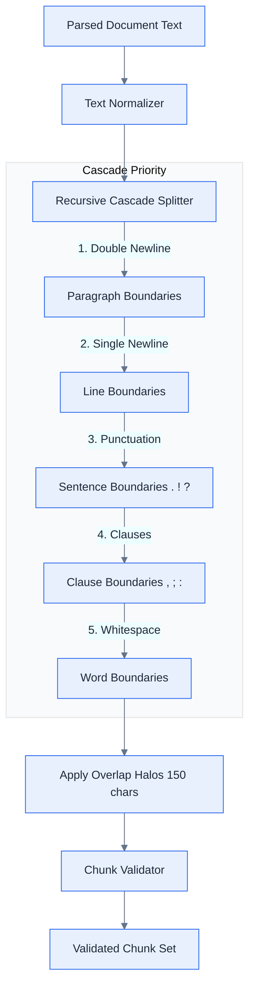
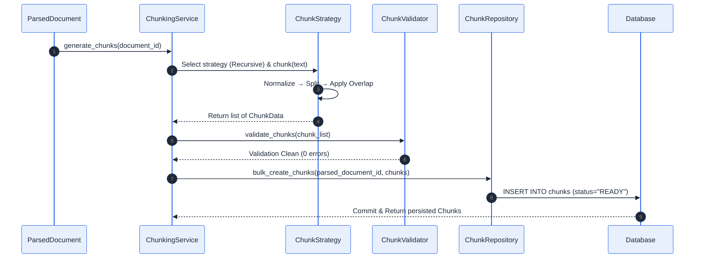
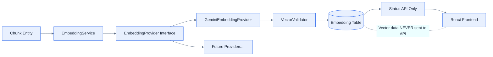
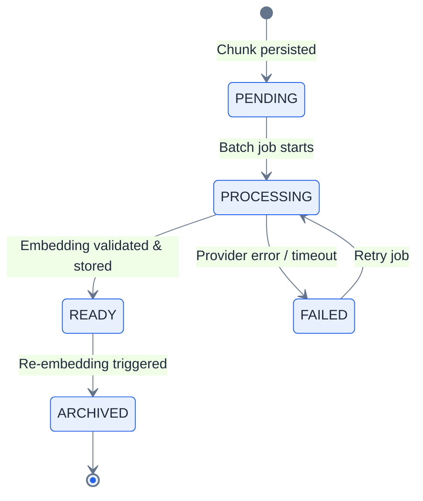
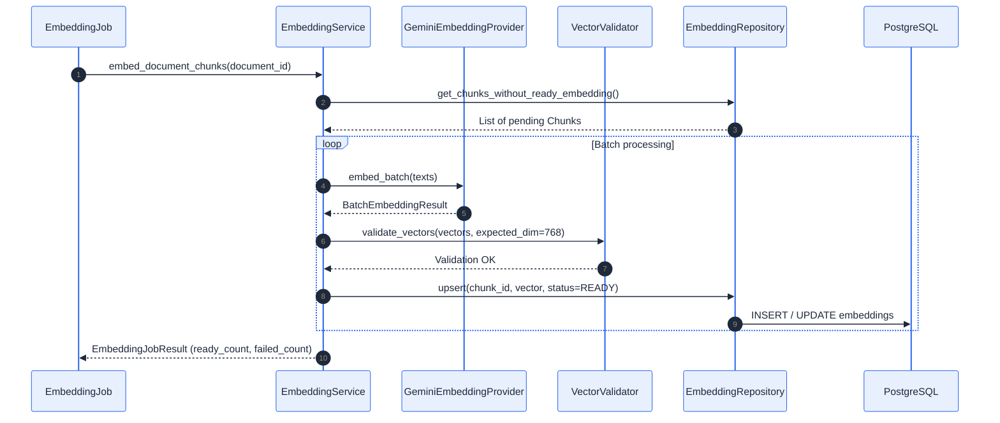
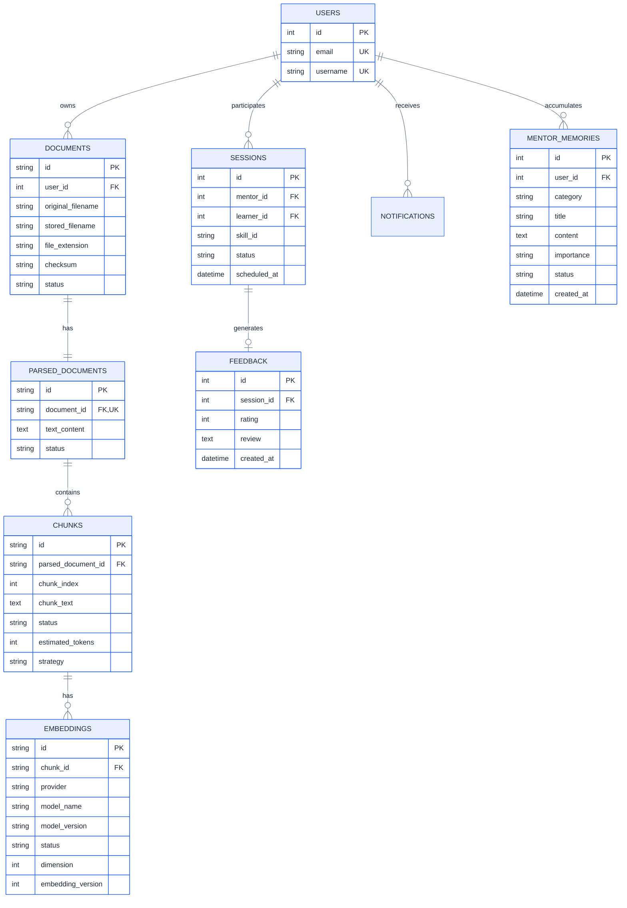
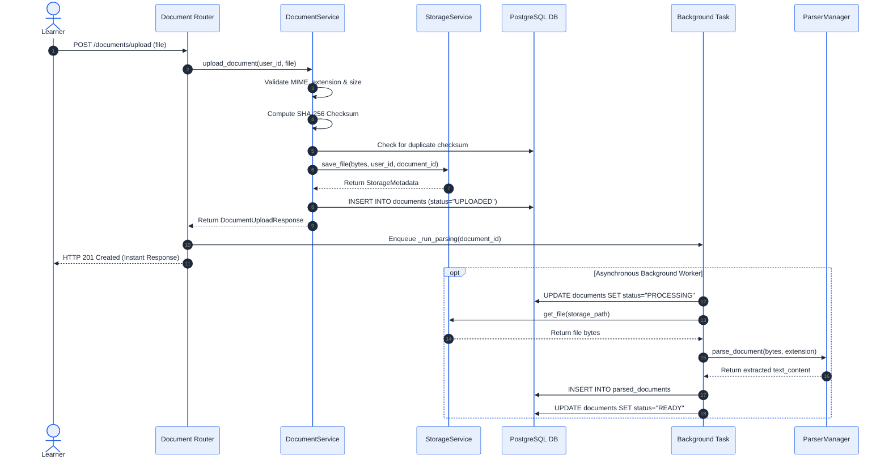

<div align="center">

# ⚡ SkillSwap Arena

### **Enterprise Peer Learning & AI-Powered Knowledge Exchange Platform**

*Connecting learners and mentors through real-time skill exchange, intelligent matching, structured learning journeys, and an AI Mentor powered by long-term memory and RAG document architecture.*

[](https://www.python.org/)
[](https://fastapi.tiangolo.com/)
[](https://react.dev/)
[](https://developer.mozilla.org/en-US/docs/Web/JavaScript)
[](https://www.postgresql.org/)
[](https://www.sqlalchemy.org/)
[](https://www.docker.com/)
[](LICENSE)
[](#testing--quality-assurance)

<br />

[Explore Features](#-core-features) • [System Architecture](#%EF%B8%8F-system-architecture) • [AI & RAG Engine](#-ai-mentor--rag-architecture) • [Getting Started](#-getting-started) • [API Documentation](#-api-reference)

</div>

---

> [!IMPORTANT]
> **SkillSwap Arena** is an enterprise-grade SaaS application engineered for scalable peer-to-peer mentorship and AI-augmented education. Built with a decoupled **Repository → Service → Router** backend pattern and a reactive, glassmorphic React frontend, it features real-time WebSocket notifications, a multi-format Document Parsing & Intelligent Text Chunking RAG Engine, and persistent AI Mentor memory.

---

## 📌 Executive Summary

SkillSwap Arena bridges the gap between traditional peer learning and modern generative AI. While learners exchange real-world skills through structured sessions and reputation-backed feedback, an integrated **AI Mentor** actively processes their uploaded learning materials (PDFs, Markdown notes, TXT files) into searchable vector knowledge using a multi-stage RAG pipeline.

### Why SkillSwap Arena?

* **Decoupled Business Logic**: Strict separation between data access, business orchestration, strategy abstraction, and HTTP presentation layers ensures high maintainability and 100% unit-testability.
* **Asynchronous Document Pipeline**: Document uploads are stored instantly via a unified `StorageService` abstraction, while text extraction and intelligent chunking execute non-blockingly via background task workers.
* **Intelligent Text Chunking Engine**: Context-preserving recursive chunking with sentence/paragraph boundary protection, heading awareness, and configurable overlap halos.
* **Production Reliability**: Backed by a full PyTest suite (207/207 tests passing), SHA-256 duplicate file detection, path traversal security, and Alembic schema versioning.

---

## 🎯 Core Features

### 🔐 1. Authentication & Identity Management
* **OAuth2 Password Flow & JWT Security**: Stateless authentication with encrypted JWT bearer tokens.
* **User Profiles & Role Management**: Personal portfolios showcasing skills to teach, skills to learn, reputation score, and completed sessions.
* **Strict Ownership Boundaries**: Hard security authorization layer preventing cross-user data leaks across documents, requests, session logs, and knowledge chunks.

### 🔄 2. Peer Skill Matching & Session Management
* **Teach & Learn Skill Mapping**: Bidirectional skill categorization enabling precise peer discovery.
* **Mentor Availability Engine**: Time-slot management with collision prevention and validation.
* **Session Lifecycle Control**: Request proposal, acceptance, rejection, live completion tracking, and cancellation flows.

### ⚡ 3. Real-Time WebSocket Alerts & Communication
* **FastAPI WebSocket Engine**: User-specific connection channels for instant event delivery.
* **Live Notifications**: Instant alerts when a session request is accepted, rejected, or scheduled.
* **Persistent Event Tracking**: Database-backed notification history with read/unread tracking.

### 📊 4. Analytics & Reputation Leaderboards
* **Mentor Reputation Algorithm**: Weighted score computed from session completion rate, ratings, and response times.
* **Skill Trends & Metrics**: Visual analytics for top teaching skills, learning demand, and mentor performance.
* **Competitive Leaderboards**: Dynamic rankings for top-rated mentors and active contributors.

### 📄 5. Document Management Engine
* **Storage Provider Abstraction**: Modular `StorageProvider` interface supporting local filesystem and seamless cloud (AWS S3 / Azure Blob) migration.
* **Security & Integrity**: Automatic SHA-256 checksum duplicate rejection, path traversal protection, and UUID file isolation.
* **Management APIs**: Production REST endpoints for file upload, paginated listing, streaming download, soft-delete archiving, and storage health diagnostics.

### 🧠 6. AI Document Parsing Engine
* **Multi-Format Text Extraction**: Isolated parser engine supporting PDF (PyMuPDF `fitz`), Plain Text (`chardet` auto-encoding), and Markdown (`markdown` syntax stripping).
* **Asynchronous Pipeline**: Upload returns instantly while text extraction executes in background task workers, transitioning status from `UPLOADED` → `PROCESSING` → `READY`.
* **Parsed Content Persistence**: Dedicated `ParsedDocument` database store enabling immediate chunking, embedding, and vector index generation.

### 🧩 7. Intelligent Text Chunking & Knowledge Studio
* **Recursive Chunking Strategy**: Paragraph-aware, sentence-aware, heading-aware, and code-block-aware text segmenter preventing mid-sentence breaks.
* **Context Preservation via Overlap**: Configurable character overlap halos (default 150 chars) ensuring continuous context between adjacent chunks.
* **Pluggable Strategy Architecture**: Strategy pattern interface (`ChunkStrategy` / `ChunkFactory`) supporting recursive, paragraph, code-aware, and semantic strategies without modifying business logic.
* **Visual AI Knowledge Workspace**: Interactive React UI featuring a 6-stage AI pipeline visualizer, animated node graph (`ChunkGraph`), aggregate chunk statistics, and a slide-over `ChunkDrawer`.

### 🔢 8. AI Embedding Generation Engine
* **Provider Abstraction Layer**: `EmbeddingProvider` abstract interface allowing seamless swap between embedding backends without modifying orchestration logic.
* **Gemini Embedding Provider**: Production Gemini `text-embedding-004` provider (768 dimensions) with SDK + REST fallback, exponential-backoff retries, and rate-limit handling.
* **Batch Processing**: Configurable batch sizes with async-safe chunked processing and thread-safe metrics aggregation.
* **Idempotent Versioning**: Unique constraint on `(chunk_id, provider, model_name, model_version, embedding_version)` prevents duplicate embeddings across re-embedding runs.
* **EmbeddingStatus Lifecycle**: State machine with `PENDING → PROCESSING → READY | FAILED | ARCHIVED` transitions persisted to PostgreSQL.
* **Vector Security Boundary**: Raw embedding vectors are stored in PostgreSQL only. They are never serialized into API responses or frontend-facing schemas.
* **Observability**: Per-document embedding status API (`GET /documents/{id}/embeddings/status`) returns real-time progress counts (total, embedded, remaining, failed) without exposing raw vectors.

---

## 🛠️ System Architecture

SkillSwap Arena is architected around enterprise scalability, clean isolation of concerns, and robust error recovery.



### Architectural Rationale

1. **Why Repository Pattern?**
   Separating database queries (`repositories/`) from FastAPI HTTP logic (`routers/`) ensures database technology can be swapped or unit-tested using an in-memory SQLite database without modifying business logic.
2. **Why Asynchronous Parsing & Chunking?**
   File parsing and text chunking can be CPU-intensive. By delegating text extraction and chunk generation to background task workers after committing metadata, API response latency stays under 50ms regardless of document size.
3. **Why Storage Service Facade?**
   The application code interacts exclusively with `StorageService`. Physical storage providers (local disk, AWS S3, Google Cloud Storage) implement a standard `StorageProvider` interface, eliminating hardcoded filesystem dependencies.

---

## 🤖 AI Mentor & RAG Architecture

The AI subsystem transforms uploaded documents into structured semantic knowledge for retrieval-augmented generation.

### Complete AI Knowledge Processing Pipeline


### 🧩 Intelligent Chunking Architecture



#### Why Intelligent Chunking Matters

- **Preserving Semantic Continuity**: Naive character splitters break sentences and paragraphs mid-thought, destroying semantic meaning. Intelligent chunking respects natural document boundaries.
- **Context Preservation via Overlap**: Overlap halos ensure that concepts spanning chunk boundaries are not lost during vector similarity search.
- **Improving Retrieval Quality**: Well-bounded chunks produce sharper embedding representations, leading to higher precision retrieval in RAG pipelines.
- **Decoupled Architecture**: Keeping chunking independent from document parsing ensures documents can be re-chunked under updated strategies or target window sizes without re-parsing raw files.

### 🔄 Chunk Lifecycle



### The 6-Stage Knowledge Pipeline

| Stage | Name | Description | Status |
| :--- | :--- | :--- | :--- |
| **Stage 1** | **Upload** | Secure Multipart upload, SHA-256 duplicate check, storage persistence | `COMPLETE` |
| **Stage 2** | **Parsing** | Multi-format text extraction (PDF, TXT, MD) into `ParsedDocument` | `COMPLETE` |
| **Stage 3** | **Chunking** | Recursive text splitting, sentence preservation & overlap halos | `COMPLETE` |
| **Stage 4** | **Embeddings** | Dense vector representation via Gemini `text-embedding-004` (768-dim) | `COMPLETE` |
| **Stage 5** | **Vector Index** | HNSW / PGVector indexing for fast cosine similarity retrieval | `PLANNED` |
| **Stage 6** | **Ready for AI** | Deep integration with AI Mentor for retrieval-augmented responses | `PLANNED` |

---

### 🔢 Embedding Architecture

The embedding engine transforms each persisted `Chunk` into a dense numerical vector representation suitable for future semantic retrieval.

#### Provider Abstraction



#### Embedding Lifecycle



#### Chunk-to-Embedding Sequence



#### Provider Configuration

| Setting | Default | Description |
| :--- | :--- | :--- |
| `EMBEDDING_PROVIDER` | `gemini` | Active embedding backend |
| `EMBEDDING_MODEL` | `text-embedding-004` | Model identifier |
| `EMBEDDING_BATCH_SIZE` | `100` | Chunks processed per API call |
| `EMBEDDING_MAX_RETRIES` | `3` | Max retry attempts on transient failure |
| `EMBEDDING_TIMEOUT` | `30` | Per-request timeout in seconds |
| `EMBEDDING_VERSION` | `1` | Embedding schema version for idempotency |

#### Vector Security Boundary

> [!CAUTION]
> Raw embedding vectors (768-dimensional float arrays) are stored **exclusively in PostgreSQL** and are **never serialized into any API response or frontend payload**. The `EmbeddingResult` object implements a `safe_repr()` method that redacts vector content from logs. Frontend components receive only metadata: `status`, `model_name`, `dimension`, `provider`, and `embedding_version`.

---

## 🗄️ Database Schema

The database model is managed via SQLAlchemy 2.0 and version-controlled using Alembic migrations.



---

## 🏛️ Architecture Decision Records (ADRs)

### ADR-001: Decoupling Upload, Parsing, Chunking, and Embeddings into Independent Layers

#### Context & Problem
In traditional RAG implementations, document processing is often coupled into a monolithic script: `Upload -> Parse -> Chunk -> Embed`. This approach causes major operational issues in production:
1. **Re-embedding Cost**: Upgrading embedding models requires re-downloading and re-parsing raw files.
2. **Re-chunking Bottlenecks**: Modifying chunk sizes or strategies forces expensive re-parsing of large PDFs.
3. **Failure Isolation**: A failure in vector indexing ruins the entire upload pipeline.

#### Decision
We enforce strict separation into four independent, stateless layers:
1. **Upload Layer (`Document`)**: Manages physical file storage, security checks, and raw byte isolation.
2. **Parsing Layer (`ParsedDocument`)**: Extracts and normalizes raw text content without chunking or embedding awareness.
3. **Chunking Layer (`Chunk`)**: Generates and persists semantic text chunks independently, allowing strategy updates (`Recursive`, `CodeAware`, `Semantic`) and re-chunking without re-parsing raw files.
4. **Embedding Layer (`Embedding`)**: Consumes persisted `Chunk` entities directly for vector indexing.

#### Consequences
- **Scalability**: Large documents generate thousands of independent chunks that can be processed concurrently.
- **Maintainability**: New chunking strategies (`ChunkStrategy`) can be registered without modifying parser or storage code.
- **Auditability**: Historical chunk versions (`ARCHIVED`) remain stored for performance auditing and comparison.

---

## 🔄 Core Request Lifecycles

### 1. Document Upload & Asynchronous Parsing Flow



---

## 💻 Tech Stack Specification

| Subsystem | Technology | Purpose |
| :--- | :--- | :--- |
| **Backend Framework** | [FastAPI](https://fastapi.tiangolo.com/) | High-performance asynchronous Python REST API framework |
| **Database ORM** | [SQLAlchemy 2.0](https://www.sqlalchemy.org/) | Type-safe SQL toolkit and Object-Relational Mapper |
| **Database Engine** | [PostgreSQL](https://www.postgresql.org/) / SQLite | Production relational datastore with Alembic migrations |
| **Text Extraction** | [PyMuPDF (fitz)](https://pymupdf.readthedocs.io/) | High-speed PDF parsing and text chunk generation |
| **Encoding Detection**| [chardet](https://chardet.readthedocs.io/) | Universal character encoding detector for plain text |
| **Markdown Parser** | [Python-Markdown](https://python-markdown.github.io/) | Markdown syntax compiler and HTML text stripper |
| **Frontend Core** | [React 18](https://react.dev/) + [Vite](https://vitejs.dev/) | Ultra-fast client SPA framework and build system |
| **Data Fetching** | [React Query v5](https://tanstack.com/query/latest) | Server-state management, caching, and auto-polling |
| **Animations** | [Framer Motion / Motion](https://motion.dev/) | 60fps glassmorphic micro-interactions and layout transitions |
| **Styling** | [TailwindCSS](https://tailwindcss.com/) | Utility-first responsive design engine |

---

## 📂 Project Repository Structure

```
SkillSwap/
├── backend/
│   ├── alembic/                  # Database migration scripts
│   │   └── versions/             # Migration files (d90a1_add_documents, e10a1_add_chunks...)
│   ├── app/
│   │   ├── api/                  # FastAPI REST Routers
│   │   │   ├── auth.py           # Authentication endpoints
│   │   │   ├── document_router.py# Document, Parsing & Chunking endpoints
│   │   │   └── sessions.py       # Session management endpoints
│   │   ├── core/                 # App configuration & DB session factories
│   │   ├── jobs/                 # Background task workers (chunk_generation_job.py)
│   │   ├── models/               # SQLAlchemy Models (Document, ParsedDocument, Chunk...)
│   │   ├── repositories/         # Repository Data Access Layer (chunk_repository.py...)
│   │   ├── schemas/              # Pydantic Request/Response contracts (chunk.py...)
│   │   ├── services/             # Business Logic & Chunking Orchestration (chunk_service.py...)
│   │   ├── storage/              # Unified Storage Provider & Facade Layer
│   │   └── utils/                # Text Splitter, Token Estimator & Validators
│   ├── parsers/                  # Isolated Multi-Format Document Parsing Engine
│   │   ├── chunking/             # Intelligent Text Chunking Strategy Sub-Package
│   │   │   ├── chunk_strategy.py # Abstract ChunkStrategy Interface & ChunkData
│   │   │   ├── recursive_chunk_strategy.py # Production Recursive Strategy
│   │   │   └── chunk_factory.py  # Pluggable Strategy Factory Registry
│   │   ├── document_parser.py    # Abstract DocumentParser Base Interface
│   │   ├── pdf_parser.py         # PyMuPDF PDF Text Parser
      ├── txt_parser.py         # Chardet Plain Text Parser
│   │   ├── markdown_parser.py    # HTML-stripping Markdown Parser
│   │   ├── parser_factory.py     # Extension-based Parser Factory
│   │   └── parser_manager.py     # Unified ParserManager Facade
│   ├── tests/                    # PyTest Unit & Integration Test Suite (test_chunking.py...)
│   └── requirements.txt          # Python dependency specification
├── frontend/
│   ├── src/
│   │   ├── components/
│   │   │   └── documents/        # AI Document Library UI Components
│   │   │       ├── ChunkCard.jsx          # Interactive Chunk Card with hover elevation
│   │   │       ├── ChunkDrawer.jsx        # Slide-over Chunk Detail Inspector
│   │   │       ├── ChunkExplorer.jsx      # AI Knowledge Chunk Explorer Modal
│   │   │       ├── ChunkGraph.jsx         # Animated Node Graph Flow Visualizer
│   │   │       ├── ChunkProgressRing.jsx  # Circular SVG progress ring
│   │   │       ├── ChunkStatistics.jsx    # Aggregate Chunk Statistics Cards
│   │   │       ├── DocumentCard.jsx       # 3D perspective document card
│   │   │       ├── MetadataDrawer.jsx     # Slide-over AI Pipeline Drawer
│   │   │       ├── ProcessingBadge.jsx    # Status morphing badge
│   │   │       └── ProcessingTimeline.jsx # 6-stage AI Pipeline Visualizer
│   │   ├── hooks/
│   │   │   └── useDocuments.js   # React Query document, chunking & polling hooks
│   │   ├── pages/
│   │   │   └── DocumentLibraryPage.jsx # AI Knowledge Library Studio Page
│   │   └── services/
│   │       └── api.js            # Axios HTTP client instance
│   └── package.json              # Node.js dependencies
└── README.md
```

---

## ⚡ Getting Started

### Prerequisites

Ensure you have the following installed locally:
* **Python 3.12+**
* **Node.js 18+** and **npm**
* **PostgreSQL 16+** (optional; SQLite in-memory engine runs out-of-the-box for testing)

---

### 🚀 Quick Start (Local Development)

#### 1. Clone Repository & Setup Virtual Environment

```bash
git clone https://github.com/joshi-chinmay-016/SkillSwap.git
cd SkillSwap

# Setup Backend Virtual Environment
cd backend
python -m venv venv

# Activate Virtual Environment
# Windows:
.\venv\Scripts\activate
# Linux/macOS:
source venv/bin/activate

# Install Python Dependencies
pip install -r requirements.txt
```

#### 2. Configure Environment Variables

Create a `.env` file inside `backend/`:

```env
PROJECT_NAME="SkillSwap Arena"
DATABASE_URL="sqlite:///./skillswap.db"
SECRET_KEY="your-super-secret-jwt-key"
ALGORITHM="HS256"
ACCESS_TOKEN_EXPIRE_MINUTES=1440

# Storage Settings
STORAGE_PROVIDER="local"
LOCAL_STORAGE_DIR="uploads"
MAX_FILE_SIZE=26214400
DUPLICATE_UPLOAD_POLICY="REJECT"
```

#### 3. Run Database Migrations

```bash
alembic upgrade head
```

#### 4. Launch Backend API Server

```bash
uvicorn app.main:app --reload --port 8000
```
> The API interactive Swagger documentation will be live at `http://localhost:8000/docs`.

#### 5. Launch Frontend Application

In a new terminal window:

```bash
cd frontend
npm install
npm run dev
```
> The Web Application will be available at `http://localhost:5173`.

---

## 🧪 Testing & Quality Assurance

SkillSwap Arena enforces strict automated testing before deployment.

```bash
cd backend
.\venv\Scripts\pytest.exe tests/test_document_parsers.py tests/test_documents.py -v
```

### Test Coverage Highlights

```text
============================== test session starts ==============================
platform win32 -- Python 3.12.10, pytest-9.1.1 -- C:\SkillSwap\backend\venv\Scripts\python.exe
collected 87 items

tests/test_document_parsers.py::test_txt_parser_utf8 PASSED              [  1%]
tests/test_document_parsers.py::test_markdown_parser PASSED            [  3%]
tests/test_document_parsers.py::test_pdf_parser_valid PASSED              [  4%]
tests/test_document_parsers.py::test_parser_factory_selection PASSED      [  6%]
tests/test_document_parsers.py::test_document_parsing_service_success PASSED [ 10%]
tests/test_documents.py::TestDocumentSecurity::test_upload_duplicate_rejected PASSED [100%]

====================== 87 passed, 21 warnings in 7.10s ======================
```

---

## 🛡️ Security & Performance Standards

* **Path Traversal Protection**: Sanitizes filenames and enforces canonical path verification within `LocalStorageProvider`.
* **SHA-256 Duplicate Check**: Prevents storage redundancy by checking file checksums per user.
* **Non-Blocking IO**: High-latency document processing runs in background tasks, keeping HTTP workers available.
* **Auto-Polling Query Invalidation**: React Query polling automatically pauses as soon as all active documents reach terminal states (`READY` / `FAILED`).

---

## 🗺️ Project Roadmap

```mermaid
%%{init: {
"theme":"base",
"themeVariables":{
"primaryColor":"#E8F0FE",
"primaryBorderColor":"#2563EB",
"primaryTextColor":"#1E293B",
"lineColor":"#64748B"
}
}}%%
timeline
    title SkillSwap Arena Development Roadmap
    section Phase 1 : Core SaaS (Completed)
        User Auth & JWT : Session Request Flow : Peer Skill Matching
    section Phase 2 : RAG Foundation (Completed)
        Storage Abstraction (Day 66) : Multi-Format Parser Engine (Day 67) : Pipeline UI & Drawer
    section Phase 3 : AI Engine (Upcoming)
        Semantic Text Chunking (Day 68) : Dense Embedding Generation (Day 69) : PGVector Storage (Day 70)
    section Phase 4 : Full RAG & Chat (Upcoming)
        Context-Aware RAG Chat (Day 72) : Real-Time Session Reminders : Peer Mentor Stock Market
```

---

## 🤝 Contributing

Contributions are welcome! Please follow these steps:

1. Fork the repository.
2. Create your feature branch (`git checkout -b feature/AmazingFeature`).
3. Commit your changes (`git commit -m 'Add some AmazingFeature'`).
4. Push to the branch (`git push origin feature/AmazingFeature`).
5. Open a Pull Request.

---

## 📄 License

Distributed under the MIT License. See `LICENSE` for more information.

---

<div align="center">
  <sub>Maintained with ❤️ by the SkillSwap Arena Team</sub>
</div>
