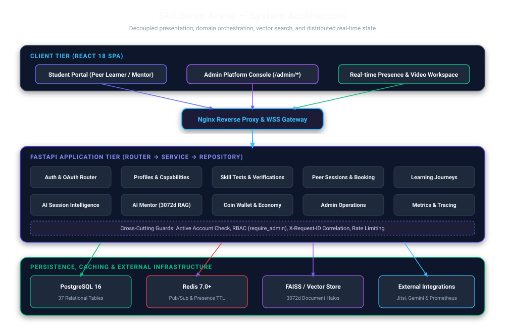
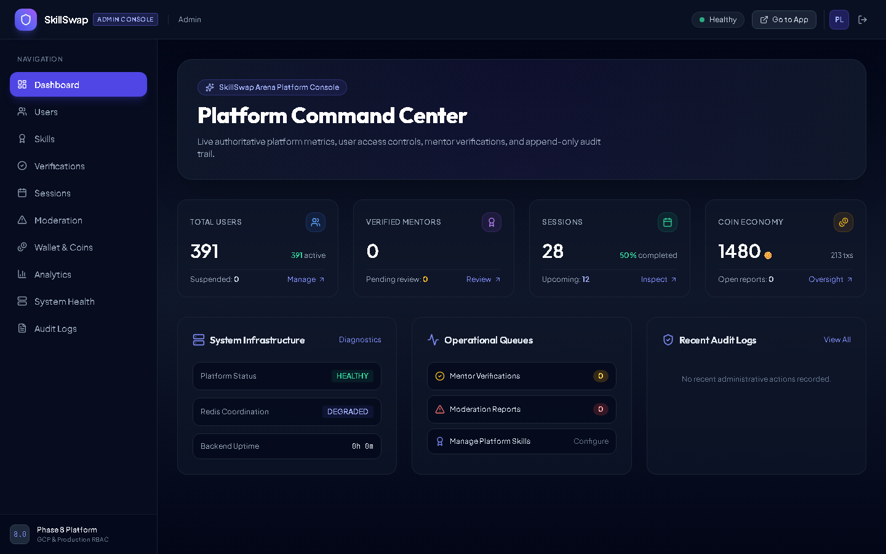
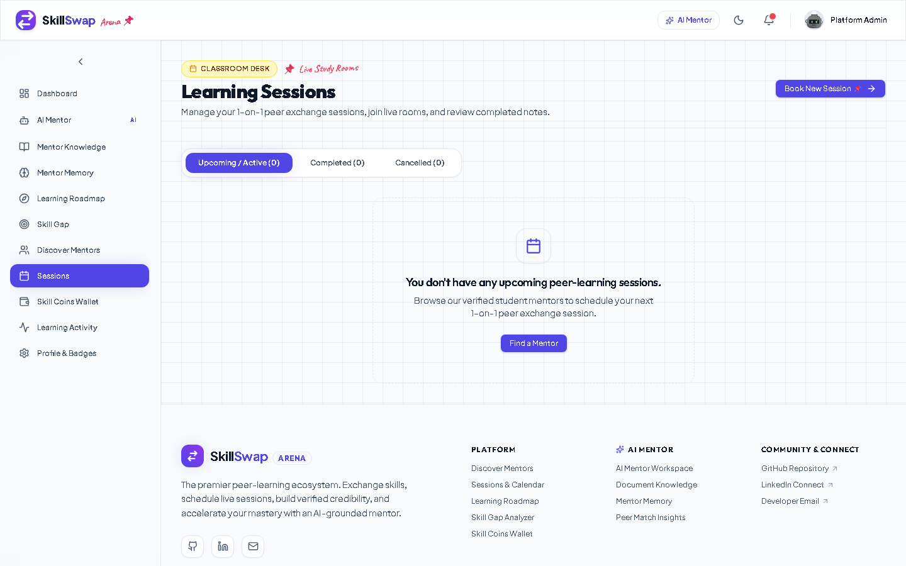
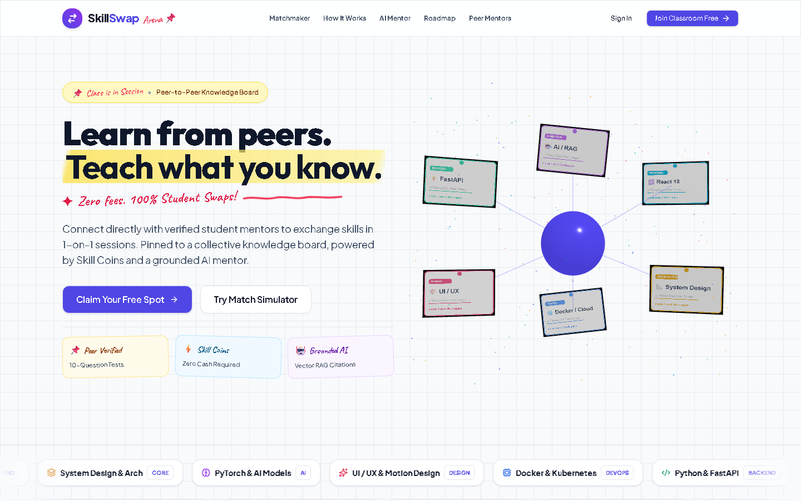

<div align="center">

# ⚡ SkillSwap Arena

### **Enterprise Peer-to-Peer Skill Exchange, AI Mentorship & Production Platform**

*An AI-powered peer learning platform where students simultaneously learn and teach through verified capabilities, live video workspaces, collaborative note capture, grounded session intelligence, and authoritative platform governance.*

[](https://www.python.org/)
[](https://fastapi.tiangolo.com/)
[](https://react.dev/)
[](https://www.postgresql.org/)
[](https://redis.io/)
[](https://cloud.google.com/run)
[](https://prometheus.io/)
[](https://www.docker.com/)

<br />

[Architecture](docs/architecture/system-architecture.md) • [Database Design](docs/database/database-design.md) • [Authentication & RBAC](docs/admin/rbac.md) • [AI Intelligence](docs/ai/session-intelligence.md) • [Admin Console](docs/admin/admin-platform.md) • [Observability](docs/infrastructure/observability.md) • [GCP Deployment](docs/infrastructure/gcp.md) • [Screenshots](docs/screenshots/README.md)

</div>

---

## 📌 Product Overview

Traditional learning platforms bind students into static hierarchies (`Learner → Course → Instructor`). **SkillSwap Arena** transforms education into a reciprocal, peer-to-peer capability exchange:

```
[ Platform User Account ]
  ├── Learn Skills  ──> Pursue Learning Journeys, book verified mentors, escrow coins
  └── Teach Skills  ──> Verify skills via assessment rubrics, host live sessions, earn coins
```

### The Core Architectural Idea
* **Mentor and Learner are NOT database roles.**
* The same account acts as a **Mentor** in skills where they have completed assessment verification, and as a **Learner** in skills where they are pursuing a roadmap.
* In **Session A**, User X mentors User Y; in **Session B**, User X learns from User Z.

---

## 🏛️ High-Level System Architecture

SkillSwap Arena is architected with a decoupled **Router → Service → Repository** pattern on FastAPI, an interactive React 18 SPA, and distributed Redis coordination:



---

## 🖼️ Visual Product Showcase

A quick visual overview captured directly from the live production build:

| Student Dashboard | Admin Command Center |
| :---: | :---: |
| [](docs/screenshots/README.md) | [](docs/screenshots/README.md) |
| *Active sessions, roadmap progress, and learning heatmap* | *Live KPI matrix, active system status, and audit stream* |

| Live Video & Notes Workspace | Admin User Management |
| :---: | :---: |
| [](docs/screenshots/README.md) | [](docs/screenshots/README.md) |
| *Embedded Jitsi video, presence sync, and 7-category notes* | *Capability inspection and audited user suspensions* |

👉 **[Explore the Complete Screenshot Gallery (10 Views)](docs/screenshots/README.md)**

---

## 🛠️ Technology Stack

| Layer | Technology | Purpose in System |
| :--- | :--- | :--- |
| **Frontend SPA** | React 18, Vite, TailwindCSS | Student collaboration portal and operator admin console. |
| **State & Data Fetching** | Zustand, TanStack React Query | Client token persistence and server-state caching/mutations. |
| **Backend API** | Python 3.12, FastAPI 0.115+ | High-performance asynchronous REST API and WebSocket gateway. |
| **Database & ORM** | PostgreSQL 16, SQLAlchemy 2.0 | 37 relational tables, ACID coin transactions, and audit logs. |
| **Schema Migrations** | Alembic (Revision `m10a1`) | Deterministic, zero-downtime relational schema lineage. |
| **Cache & Coordination** | Redis 7.0+ (RESP3) | Multi-worker WebSocket Pub/Sub, presence TTLs, and rate limiting. |
| **Video Infrastructure** | Jitsi Meet (WebRTC) | Authoritative, server-scoped audio and video peer rooms. |
| **AI Synthesis & RAG** | Google Gemini LLM, FAISS CPU | Grounded session intelligence and 3072d vector document RAG. |
| **Observability** | Prometheus, Grafana | Low-cardinality metrics (`/metrics`), latency histograms, tracing. |
| **Containerization** | Docker (Multi-stage, Non-root) | Minimal Python 3.12 slim and Nginx Alpine container images. |
| **Cloud Target** | GCP Cloud Run, Cloud SQL, VPC | Serverless container execution with private VPC data peering. |
| **Infrastructure as Code** | Terraform (Google Provider ~> 5.20) | Automated GCP cloud resource and network provisioning. |
| **CI/CD Pipeline** | GitHub Actions | Automated tests, Postgres/Redis service containers, image builds. |

---

## ⚡ Core Engineering Highlights

### 1. Concurrency-Safe Coin Escrow & Booking Idempotency
Booking a session locks 1 coin in escrow from the learner's wallet using an `Idempotency-Key` header. If a cancellation occurs, an automated refund is executed idempotently (`reference_id = f"refund_session_{id}"`).

### 2. Grounded AI Session Intelligence & Anti-Fabrication Fencing
Session summaries are synthesized from live collaborative notes using prompt isolation fences (`<session_data>`). Untrusted user input is treated strictly as data, not instructions. A sufficiency guard prevents LLM hallucinations on sparse data.

### 3. Horizontally Scalable WebSockets via Redis Pub/Sub
WebSocket connections (`/ws/{user_id}`) coordinate across multiple worker processes and server instances through Redis channels (`channel:session:{id}`), eliminating single-node memory bottlenecks.

### 4. Authoritative Platform RBAC & Append-Only Audit Trail
Platform operators (`role == "ADMIN"`) manage user access, verifications, reports, and coin balances through `/admin/*`. Every mutation requires a mandatory justification reason and is immutably recorded in `admin_audit_logs`.

---

## 📂 Repository Structure

```
SkillSwap/
├── backend/                      # FastAPI Python application
│   ├── alembic/                  # Database migration versions
│   ├── app/                      # API routers, services, models, repositories, AI engines
│   └── tests/                    # Pytest test suite (600+ platform tests)
├── frontend/                     # React 18 SPA application
│   ├── src/                      # Components, pages, admin console, Zustand stores
│   └── nginx.conf                # Production SPA routing fallback
├── deploy/                       # Cloud infrastructure blueprints
│   └── gcp/                      # Cloud Run manifests, deploy scripts, and Terraform IaC
├── docker/                       # Production networking & monitoring
│   └── production/               # Nginx reverse proxy, Prometheus, and Grafana provisioning
├── docs/                         # Comprehensive technical documentation & diagrams
│   ├── architecture/             # System design, data flow, and ADRs
│   ├── database/                 # Relational schema, ER diagram, and migration guides
│   ├── authentication/           # Auth flows, OAuth2, and authorization guards
│   ├── sessions/                 # Session state machine, Jitsi, and WebSockets
│   ├── ai/                       # Grounded session intelligence and prompt security
│   ├── admin/                    # Admin platform console and audit logging
│   ├── infrastructure/           # Docker, Nginx, Redis, Observability, and GCP
│   ├── diagrams/                 # 10 production SVG diagrams and Mermaid sources
│   └── screenshots/              # Real application screenshot showcase
├── .github/workflows/ci-cd.yml   # Automated GitHub Actions pipeline
└── docker-compose.yml            # Local production multi-container orchestration
```

---

## 🚀 Quick Start

### Option A: Local Production Stack via Docker Compose (Recommended)

Launch the complete local production topology (FastAPI, React SPA, PostgreSQL 16, Redis 7, Prometheus, Grafana) with a single command:

```bash
# 1. Clone the repository
git clone https://github.com/joshi-chinmay-016/SkillSwap.git
cd SkillSwap

# 2. Configure environment variables
cp .env.example .env

# 3. Launch Docker Compose stack
docker compose up --build -d
```

#### Access Local Endpoints
* **Web Application**: `http://localhost:5173`
* **Admin Console**: `http://localhost:5173/admin`
* **Backend API Documentation**: `http://localhost:8000/docs`
* **Prometheus Metrics**: `http://localhost:8000/metrics`
* **Prometheus UI**: `http://localhost:9090`
* **Grafana Dashboards**: `http://localhost:3001` (user: `admin`, password: `admin`)

---

### Option B: Standalone Local Development

#### 1. Backend Setup
```bash
cd backend
python -m venv venv
source venv/bin/activate  # Or `venv\Scripts\activate` on Windows
pip install -r requirements.txt

# Run database migrations & seed admin account
alembic upgrade head
python -m app.scripts.seed_admin --email "<YOUR_ADMIN_EMAIL>" --password "<YOUR_SECURE_PASSWORD>" --name "Platform Admin"

# Start FastAPI development server
uvicorn app.main:app --reload --port 8000
```

#### 2. Frontend Setup
```bash
cd frontend
npm install
npm run dev
```

---

## 🧪 Testing & Verification

Run the comprehensive test suite across all platform domains:

```bash
cd backend
pytest tests/test_phase8_*.py tests/test_phase7_*.py tests/test_phase6_*.py tests/test_phase5_*.py tests/test_phase4_*.py tests/test_phase3_*.py tests/test_phase2_*.py -v
```

Verify frontend production build compilation:
```bash
cd frontend
npm run build
```

---

## 📚 Documentation Index

Explore the in-depth technical documentation:

* 🏛️ **Architecture & Design**:
  - [System Architecture](docs/architecture/system-architecture.md)
  - [Component Architecture](docs/architecture/component-architecture.md)
  - [Backend Architecture](docs/architecture/backend-architecture.md)
  - [Frontend Architecture](docs/architecture/frontend-architecture.md)
  - [Data Flow Pathways](docs/architecture/data-flow.md)
  - [Architecture Decision Records (ADRs)](docs/architecture/decisions.md)
* 🗄️ **Database & Schema**:
  - [Database Design & Integrity Rules](docs/database/database-design.md)
  - [Entity Relationship (ER) Diagram](docs/database/er-diagram.md)
  - [Alembic Migrations Guide](docs/database/migrations.md)
* 🔐 **Authentication & Security**:
  - [Authentication Flow & JWT Lifecycle](docs/authentication/authentication-flow.md)
  - [OAuth2 SSO & Account Linking](docs/authentication/oauth-flow.md)
  - [Authorization & RBAC Capability Model](docs/authentication/authorization.md)
* 🤝 **Sessions & Real-Time**:
  - [Session Lifecycle State Machine](docs/sessions/session-lifecycle.md)
  - [Jitsi Meet Video Integration](docs/sessions/jitsi-integration.md)
  - [Real-Time Presence & WebSockets](docs/sessions/realtime-presence.md)
* 🧠 **AI & Session Intelligence**:
  - [Grounded AI Session Intelligence](docs/ai/session-intelligence.md)
  - [Learning Journeys & Progress Tracking](docs/ai/learning-journey.md)
  - [Prompt Isolation & Grounding Security](docs/ai/grounding-and-security.md)
* 🛡️ **Platform Governance**:
  - [Admin Platform Console](docs/admin/admin-platform.md)
  - [Role-Based Access Control](docs/admin/rbac.md)
  - [Append-Only Audit Logging](docs/admin/audit-logging.md)
* ☁️ **Infrastructure & CI/CD**:
  - [Production Docker Architecture](docs/infrastructure/docker.md)
  - [Nginx Gateway & Reverse Proxy](docs/infrastructure/nginx.md)
  - [Redis Caching & Coordination](docs/infrastructure/redis.md)
  - [Prometheus Metrics & Observability](docs/infrastructure/observability.md)
  - [GCP Cloud Run & Terraform Deployment](docs/infrastructure/gcp.md)
  - [GitHub Actions CI/CD Pipeline](docs/cicd/github-actions.md)
  - [API Overview & Route Catalog](docs/api/api-overview.md)
* 🖼️ **Visual Assets**:
  - [Product Screenshots Gallery](docs/screenshots/README.md)

---

## 📄 License

This project is licensed under the MIT License — see the [LICENSE](LICENSE) file for details.
