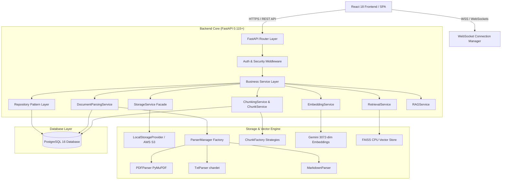

<div align="center">

# ⚡ SkillSwap Arena

### **Enterprise Peer-to-Peer Skill Exchange & AI-Augmented Mentorship Platform**

*Empowering learners and mentors through real-time skill matching, structured peer learning sessions, reputation-backed feedback, and an integrated AI Mentor powered by 3072-dimensional vector RAG document architecture.*

[](https://www.python.org/)
[](https://fastapi.tiangolo.com/)
[](https://react.dev/)
[](https://www.postgresql.org/)
[](LICENSE)
[](#8-testing)

<br />

[Explore Documentation](#-technical-documentation) • [System Architecture](#-system-architecture) • [Core Features](#-core-features) • [Quick Start](#-quick-start) • [Contributing](docs/CONTRIBUTING.md)

</div>

---

## 📌 Executive Summary

**SkillSwap Arena** is an enterprise SaaS platform engineered for collaborative peer-to-peer education and AI-augmented mentorship. Built with a strict **Router → Service → Repository** decoupled backend pattern and a glassmorphic React 18 SPA frontend, SkillSwap Arena enables students to exchange real-world skills through scheduled peer sessions while leveraging an integrated **AI Mentor** to transform raw course documents (PDFs, Markdown, TXT) into a grounded RAG knowledge engine.

### Key Value Propositions
* 🔄 **Peer-to-Peer Skill Match Engine**: Match students based on reciprocal skill supply and demand (skills to teach vs. skills to learn).
* 🤖 **AI-Augmented Mentorship Support**: Multi-format document ingestion, intelligent text chunking with 150-char overlap halos, and Gemini 3072-dimensional vector retrieval.
* ⚡ **Authenticated Real-Time WebSockets**: Dedicated user notification channels with JWT security enforcement (`/ws/{user_id}`).
* 🛡️ **Zero-Trust Hard Security Boundary**: Strict ownership isolation ensuring cross-tenant data leaks are impossible across documents, chunks, and sessions.

---

## 📚 Technical Documentation

Deep technical guides, system diagrams, and architectural decisions are organized under [`/docs`](docs/):

| Document | Description |
| :--- | :--- |
| 🏛️ **[System Architecture](docs/ARCHITECTURE.md)** | High-level system architecture, sequence flows, WebSocket lifecycle, and database ERD. |
| 🧠 **[RAG Pipeline Architecture](docs/RAG_PIPELINE.md)** | Document parsing, 3072-dim embeddings, FAISS CPU vector storage, and grounded answer validation. |
| 📜 **[Architecture Decision Records](docs/ADR.md)** | Architectural decisions, technology choices, and design trade-offs. |
| 🗺️ **[Product Roadmap](docs/ROADMAP.md)** | Phased evolution status and future engineering goals. |
| 🤝 **[Contributing Guide](docs/CONTRIBUTING.md)** | Forking, cloning, branch naming, local setup, commit standards, and PR workflows. |

---

## 🏛️ System Architecture

SkillSwap Arena maintains strict separation between HTTP presentation, domain orchestration, vector processing, and relational storage.



---

## 🎯 Core Features

### 🔄 1. Peer Skill Matching & Discovery
* **Skill Catalog**: Bidirectional skill taxonomy enabling students to list skills they offer to teach and skills they want to learn.
* **Mentor Recommendation Engine**: Algorithmic pairing based on complementary skill demand, response times, and mentor ratings.
* **Public Mentor Cards**: Detailed mentor profiles displaying bio, department, badges, completed sessions, and feedback score.

### 📅 2. Session Booking & Availability Management
* **Collision-Free Time Slots**: Mentors define recurring or specific availability windows with automated overlap protection.
* **Session Lifecycle Control**: Full state machine (`SCHEDULED → COMPLETED | CANCELLED`) for session booking and completion.
* **Structured Post-Session Summaries**: AI-assisted key takeaways, strengths, and follow-up topics saved to `SessionSummary`.

### ⚡ 3. Authenticated WebSocket Real-Time Alerts
* **FastAPI WebSocket Manager**: Real-time event streaming over authenticated WebSockets.
* **Mandatory JWT Handshake**: Connections require `?token=<JWT>` with user ID verification (`sub == user_id`). Unauthenticated connections are dropped with code `1008`.
* **Live Notifications**: Instant alerts when session requests are sent, accepted, rejected, or completed.

### 🏆 4. Analytics, Streaks & Leaderboards
* **Reputation Engine**: Weighted scoring algorithm tracking session completion rate, student ratings, and peer contributions.
* **Learning Streaks & Heatmap**: Daily activity tracking, streak milestones, and activity distribution heatmaps.
* **Leaderboard Rankings**: Dynamic rankings recognizing top mentors and active peer learners.

### 🧠 5. AI Mentor & Grounded RAG Pipeline
* **Asynchronous Multi-Format Parsing**: PyMuPDF (PDF), Chardet (TXT), and Markdown extractors.
* **Intelligent Chunking Engine**: Context-preserving recursive chunking with sentence/paragraph boundary protection and 150-char overlap halos.
* **3072-Dim Gemini Embeddings**: Dense vector representations indexed in FAISS CPU (`IndexIDMap2`).
* **Grounded Answers**: LLM answers strictly grounded in student study documents with backend-verified source attribution.

---

## 🖼️ User Interface Screenshots & Demonstrations

> [!NOTE]
> *UI screenshots showcase the responsive React glassmorphic design system.*

<!-- TODO: Add screenshot of Peer Mentor Discovery & Search -->

*Figure 1: Peer Mentor Discovery & Skill Matching Interface*

<!-- TODO: Add screenshot of Booking Modal & Slot Picker -->

*Figure 2: Interactive Session Booking & Time-Slot Picker*

<!-- TODO: Add screenshot of Active Learning Session View -->

*Figure 3: Active Learning Session View & Summary Dashboard*

<!-- TODO: Add screenshot of AI Mentor Knowledge Studio -->

*Figure 4: AI Mentor Knowledge Studio & RAG Document Search*

---

## 🛠️ Technology Stack

| Component | Technology | Description |
| :--- | :--- | :--- |
| **Frontend Core** | React 18, Vite | Reactive SPA framework with sub-second HMR |
| **Styling & UI** | Vanilla CSS, Lucide Icons | Glassmorphic UI design system with micro-animations |
| **Backend Framework** | FastAPI 0.115+, Python 3.12 | High-performance asynchronous REST & WebSocket API |
| **Database & ORM** | PostgreSQL 16, SQLAlchemy 2.0 | Relational database with Alembic schema versioning |
| **Security & Auth** | OAuth2, Encrypted JWT, Passlib | Stateless JWT bearer authentication & password hashing |
| **Vector Engine** | FAISS CPU (`IndexIDMap2`) | Low-latency local vector indexing & cosine similarity |
| **AI & Embeddings** | Google Gemini (`gemini-embedding-001`) | 3072-dimensional vector embedding generation |
| **Testing Suite** | PyTest, FastAPI TestClient | Comprehensive unit & integration testing suite |

---

## 🚀 Quick Start Guide

### Prerequisites
* Python 3.12+
* Node.js 18+
* PostgreSQL 16+

### 1. Clone & Set Up Backend
```bash
# Clone the repository
git clone https://github.com/joshi-chinmay-016/SkillSwap.git
cd SkillSwap/backend

# Create virtual environment
python -m venv venv
# Linux/macOS:
source venv/bin/activate
# Windows:
.\venv\Scripts\Activate.ps1

# Install dependencies & run migrations
pip install -r requirements.txt
cp .env.example .env
alembic upgrade head

# Start FastAPI server
uvicorn app.main:app --reload --port 8000
```

### 2. Set Up Frontend
```bash
cd ../frontend
npm install
npm run dev
```
Navigate to [http://localhost:5173](http://localhost:5173) in your web browser.

---

## 🧪 Testing & Verification

Run the PyTest test suite:
```bash
cd backend
python -m pytest
```

### Verification Baseline
* **Test Suite Status**: 560 Passed, 2 Skipped, 0 Warnings/Deprecations.
* **WebSocket Security**: 100% Pass rate on JWT validation & close code 1008 assertions.
* **Retrieval Metrics**: 100% Pass rate on Router → Service → Repository metrics endpoint.

---

## 📄 License

Distributed under the MIT License. See [`LICENSE`](LICENSE) for details.

---

## 🔗 Deep Links & Resources

* 🏛️ [System Architecture & ERD Diagram](docs/ARCHITECTURE.md)
* 🧠 [RAG Pipeline & Vector Indexing Architecture](docs/RAG_PIPELINE.md)
* 📜 [Architecture Decision Records (ADRs)](docs/ADR.md)
* 🤝 [Step-by-Step Contributing Guide](docs/CONTRIBUTING.md)
* 🗺️ [Product Roadmap & Evolution](docs/ROADMAP.md)
