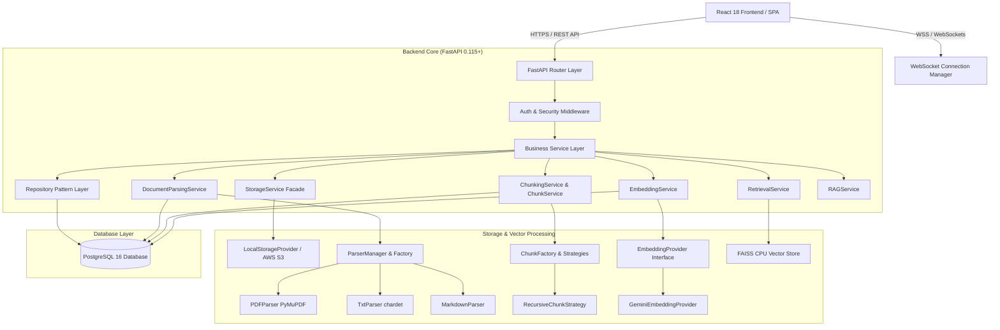
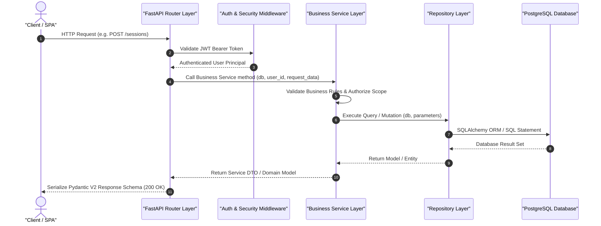
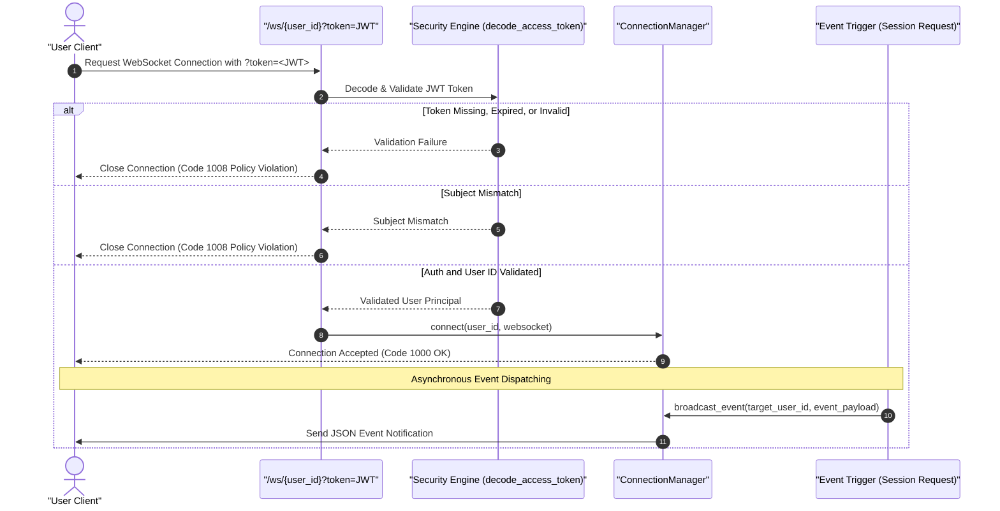
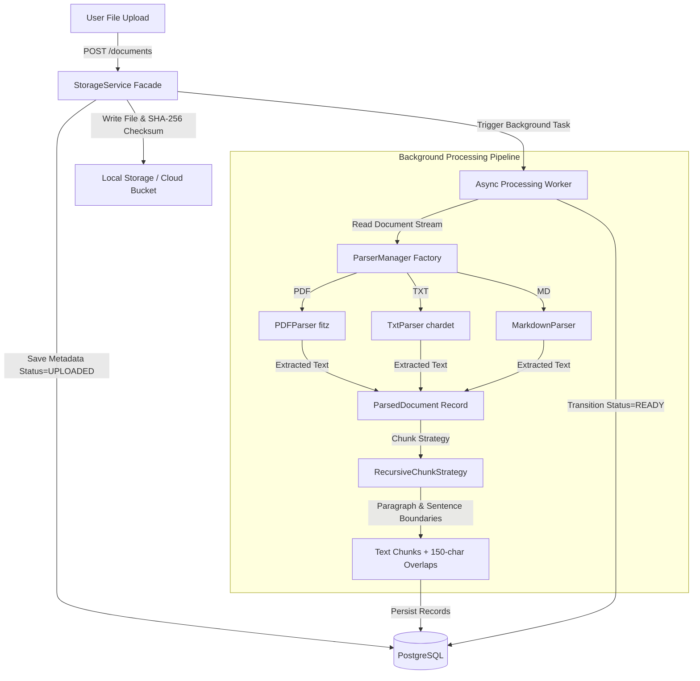

# 🏛️ System Architecture — SkillSwap Arena

SkillSwap Arena is an enterprise-grade peer-learning and mentorship platform built on a decoupled, multi-tiered architecture designed for security, sub-50ms API responsiveness, and horizontal scalability.

---

## 📐 High-Level System Architecture Overview

The system decouples presentation, domain orchestration, vector search, relational storage, and real-time communications.



---

## 🔄 Core Request Lifecycle (Router → Service → Repository)

Every REST HTTP request follows a strict unidirectional data flow ensuring 100% isolation between presentation schemas and data access ORM logic.



---

## ⚡ Real-Time WebSocket Communication Architecture

WebSocket connections are authenticated before handshake completion and tracked by an in-memory `ConnectionManager`.



---

## 📄 Document Ingestion, Parsing & Chunking Subsystem

Document processing is completely asynchronous to ensure file uploads never block main API loop threads.



---

## 🗄️ Database Schema & Entity-Relationship Diagram (ERD)

The PostgreSQL relational database is version-controlled via Alembic migrations.

```mermaid
erDiagram
    USERS {
        int id PK
        string email UK
        string password_hash
        string name
        int reputation_score
        datetime created_at
    }

    PROFILES {
        int id PK
        int user_id FK
        string bio
        string department
        int year
        string avatar_url
    }

    SKILLS {
        int id PK
        string name UK
        string category
        string description
    }

    USER_SKILLS {
        int id PK
        int user_id FK
        int skill_id FK
        string type
    }

    LEARNING_JOURNEYS {
        int id PK
        int user_id FK
        string title
        string description
        string status
    }

    LEARNING_SESSIONS {
        int id PK
        string uuid UK
        int user_id FK
        int journey_id FK
        string title
        string status
        datetime started_at
        datetime ended_at
    }

    SESSION_SUMMARIES {
        int id PK
        string uuid UK
        int session_id FK UK
        text summary
        json key_takeaways
        json strengths
        json weaknesses
        json follow_up_topics
    }

    FEEDBACK {
        int id PK
        int session_id FK
        int reviewer_id FK
        int reviewee_id FK
        int rating
        string comment
    }

    DOCUMENTS {
        string id PK
        int user_id FK
        string original_filename
        string storage_path
        string checksum
        string status
    }

    PARSED_DOCUMENTS {
        string id PK
        string document_id FK UK
        text text_content
        string status
    }

    CHUNKS {
        string id PK
        string parsed_document_id FK
        int user_id FK
        int chunk_index
        text chunk_text
        string status
    }

    EMBEDDINGS {
        string id PK
        string chunk_id FK
        int user_id FK
        string provider
        string model_name
        int dimension
        string status
    }

    VECTOR_INDEX_ENTRIES {
        int id PK
        string embedding_id FK UK
        int faiss_id UK
        string status
    }

    USERS ||--o| PROFILES : has
    USERS ||--o{ USER_SKILLS : possesses
    SKILLS ||--o{ USER_SKILLS : categorizes
    USERS ||--o{ LEARNING_JOURNEYS : pursues
    LEARNING_JOURNEYS ||--o{ LEARNING_SESSIONS : contains
    LEARNING_SESSIONS ||--o| SESSION_SUMMARIES : generates
    LEARNING_SESSIONS ||--o{ FEEDBACK : receives
    USERS ||--o{ FEEDBACK : reviews
    USERS ||--o{ DOCUMENTS : owns
    DOCUMENTS ||--o| PARSED_DOCUMENTS : parses
    PARSED_DOCUMENTS ||--o{ CHUNKS : splits
    CHUNKS ||--o{ EMBEDDINGS : embeds
    EMBEDDINGS ||--o| VECTOR_INDEX_ENTRIES : indexes
```
