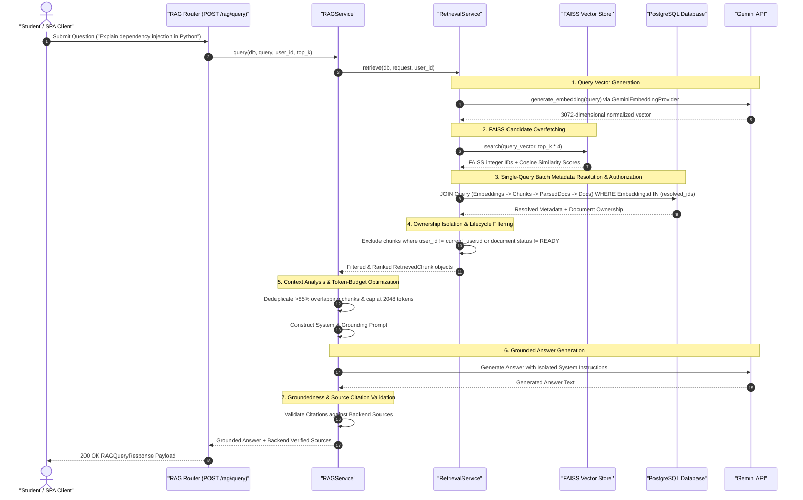
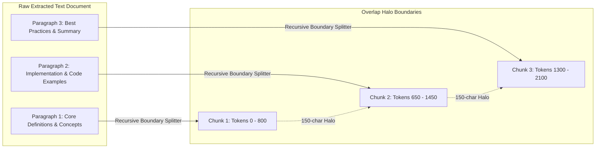
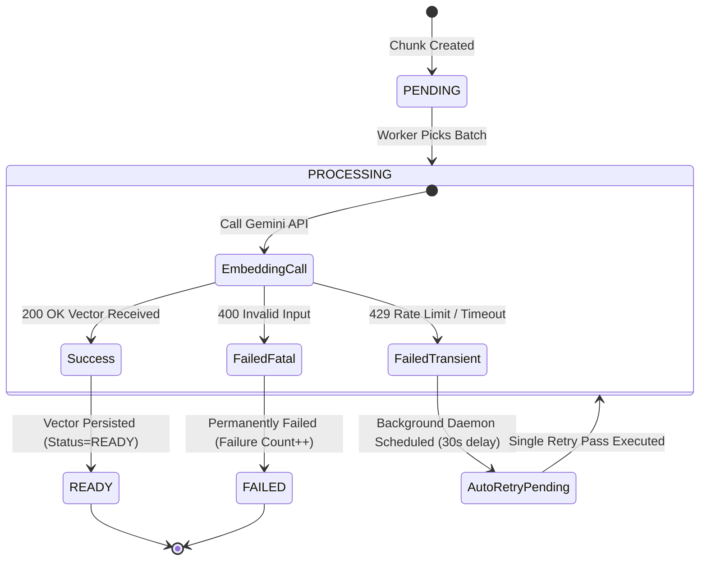
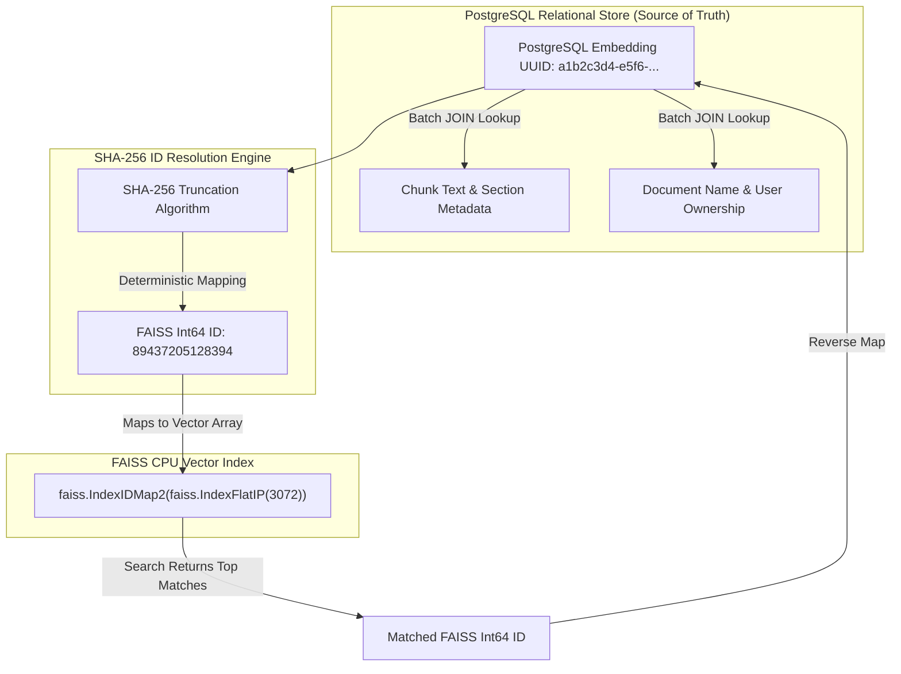

# 🧠 AI Mentor & Grounded RAG Pipeline — SkillSwap Arena

The **RAG (Retrieval-Augmented Generation)** engine in SkillSwap Arena allows students to convert study materials (PDFs, Markdown notes, text files) into searchable vector knowledge and receive grounded, accurate guidance from the **AI Mentor**.

---

## 🔄 End-to-End Grounded RAG Query Execution Flow

---

## 🧩 Text Chunking & Overlap Halo Strategy

To prevent context truncation across sentence or paragraph boundaries, text is segmented using `RecursiveChunkStrategy` with a 150-character overlap halo.

---

## 🔢 Embedding Generation & Non-Blocking Retry State Machine

Vector embeddings are generated using Gemini `gemini-embedding-001` (3072 dimensions) with automatic background retry handling for transient API rate limits.

---

## 🗄️ FAISS Vector Storage & PostgreSQL ID Mapping Architecture

SkillSwap Arena couples PostgreSQL metadata storage with FAISS CPU vector index performance.

---

## 🔬 RAG Pipeline Subsystems & Safety Invariants

### 1. Hard Ownership Security Boundary
All vector search results undergo PostgreSQL metadata verification before context assembly. Results where `document.user_id != current_user.id` or `document.status != READY` are strictly dropped. User A can never access User B's knowledge base.

### 2. Untrusted LLM Citations
Large Language Models cannot be trusted to generate accurate citation indices. The RAG pipeline strips LLM-generated bracketed citations and independently constructs the response `sources` list directly from verified retrieved chunk metadata.

### 3. Context Quality Analysis & Optimization Pass
- **Overlap Reduction**: Chunks sharing >85% Jaccard text overlap are pruned to maximize context diversity.
- **Token Capping**: Retrieved context is capped at 2048 tokens to avoid context diluting or prompt truncation.
