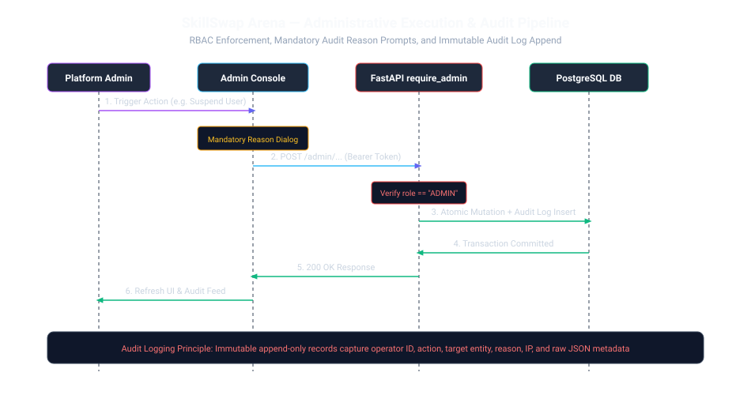

# Platform Administration Console

SkillSwap Arena provides a dedicated, authoritative administration console mounted at `/admin/*` for platform operators with `role == "ADMIN"`.

---

## 1. 10 Operational Views

1. **Platform Dashboard (`/admin`)**: High-level KPI matrix, active system status, Three.js ambient background visualizer, and recent audit activity stream.
2. **User Management (`/admin/users`)**: Search, role filtering, detail drawer, suspension and reactivation with mandatory audit justification.
3. **Platform Skills (`/admin/skills`)**: Skill catalog management, verified mentor statistics, learner demand metrics, and skill creation/editing.
4. **Mentor Verifications (`/admin/verification`)**: Candidate test review queue, test score inspection, and approval/rejection workflows.
5. **Session Oversight (`/admin/sessions`)**: Live session monitoring and administrative cancellation with automated coin refunds.
6. **Moderation & Reports (`/admin/reports`)**: User complaint triage and resolution workflows (`OPEN`, `UNDER_REVIEW`, `RESOLVED`, `DISMISSED`).
7. **Wallet & Economy (`/admin/wallet`)**: Circulating supply oversight, transaction feed, and audited manual balance adjustments.
8. **Analytics & Growth (`/admin/analytics`)**: Live Recharts visualizations derived directly from PostgreSQL database aggregations.
9. **System Diagnostics (`/admin/system`)**: Live PostgreSQL query ping latency, Redis ping latency, uptime counter, and release environment.
10. **Append-Only Audit Trail (`/admin/audit-logs`)**: Filterable compliance log with raw JSON metadata inspector.

---

## 2. Mandatory Audit Prompts & Security

All sensitive administrative actions enforce:
- **FastAPI Guard (`require_admin`)**: Rejects non-admin tokens with `403 Forbidden`.
- **Mandatory Justification Reason**: Operations cannot proceed without an operator justification string.
- **Atomic Database Commit**: Changes are committed in an atomic database transaction alongside the `admin_audit_logs` entry.
