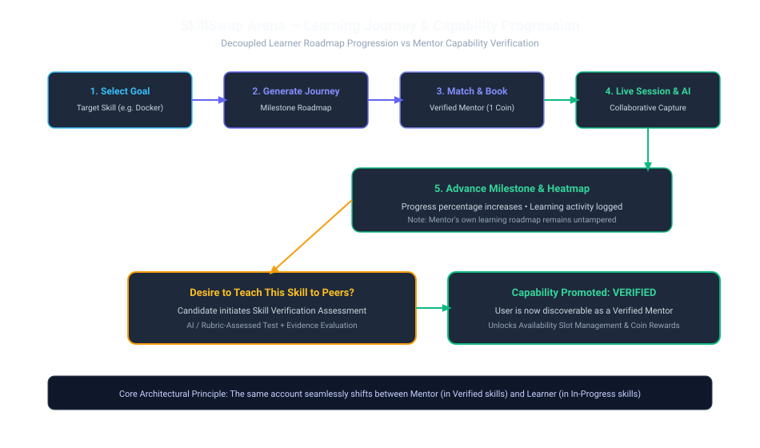

# Learning Journeys & Skill Progress

SkillSwap Arena provides structured Learning Journeys with automated milestone tracking, skill gap analysis, and activity contribution heatmaps.

---

## 1. Journey Architecture

- **Entity (`learning_journeys`)**: Links a `user_id` to a target `skill_id`.
- **Roadmap Milestones**: Breaks learning goals into progressive milestones (Fundamentals → Intermediate Architecture → Advanced Production Topics).
- **Decoupled Progress Calculation**:
  - Advancing a journey occurs when the user participates as a **Learner** in a completed session.
  - When the user mentors another peer, the session **does not** advance the mentor's own learning journey.

---

## 2. Activity Heatmap & Analytics

- **`learning_activities`**: Granular time-series event log recording session completions, milestone advancements, and skill assessment achievements.
- **Heatmap Visualization**: Aggregates daily learning intensity scores (1–4 scale) to power the GitHub-style contribution heatmap on the user dashboard.
