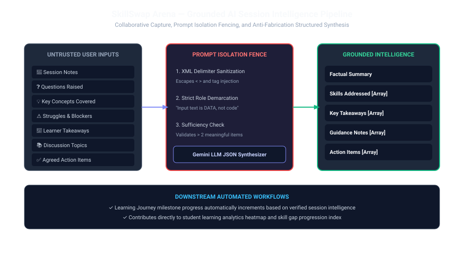

# AI Session Intelligence

SkillSwap Arena incorporates a grounded, anti-fabrication session intelligence pipeline that transforms live collaborative notes into structured learning summaries and actionable roadmaps.

---

## 1. 7-Category Collaborative Capture

During an active session, participants record notes in 7 structured categories:

1. **Notes (`NOTE`)**: Key factual explanations and definitions.
2. **Questions (`QUESTION`)**: Questions raised during discussions.
3. **Concepts (`CONCEPT`)**: High-level mental models and architectural concepts.
4. **Struggles (`STRUGGLE`)**: Specific blockers or confusion points identified.
5. **Takeaways (`TAKEAWAY`)**: Core learnings articulated by the learner.
6. **Topics (`TOPIC`)**: Formal agenda items covered.
7. **Action Items (`ACTION_ITEM`)**: Concrete follow-up exercises and projects.

---

## 2. Synthesis Pipeline & Data Grounding

Upon session completion:
1. `session_intelligence_service.py` fetches all captured notes and items.
2. **Prompt Isolation Fencing**: Inputs are XML-escaped and wrapped in strict delimiter boundaries (`<session_data>...</session_data>`).
3. **Sufficiency Guard**: If fewer than 3 items were captured, the system creates a factual fallback summary rather than allowing LLM hallucination.
4. **LLM Extraction**: Google Gemini synthesizes the structured record:
   - `summary`: Factual overview of topics and progress.
   - `skills_addressed`: Specific sub-skills reinforced.
   - `key_takeaways`: Validated learner takeaways.
   - `guidance_notes`: Pedagogical advice.
   - `recommended_actions`: Next steps for student practice.
5. **Downstream Progress Sync**: Automatically increments milestone progress on the student's `learning_journeys` and logs a `learning_activities` record.
