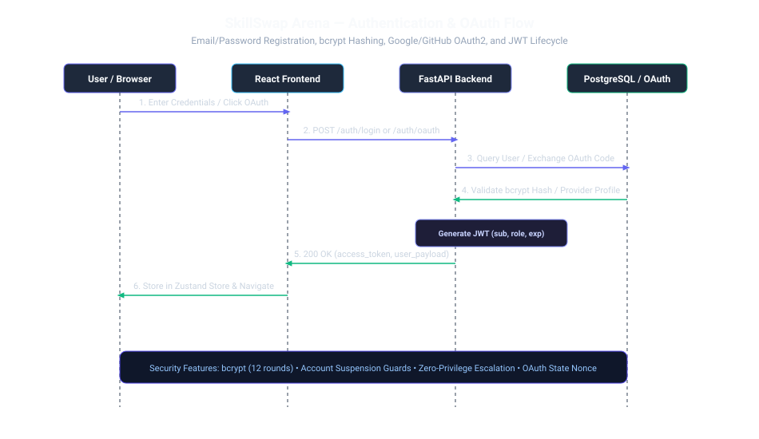

# Authentication Flow & Token Lifecycle

SkillSwap Arena implements stateless JWT authentication combined with salted password hashing and account state validation.



---

## 1. Registration Flow (`POST /auth/register`)

```
1. User submits { email, password, name }
2. Validation: Email uniqueness, password complexity
3. Password Hashing: bcrypt with 12 salt rounds
4. Database Mutation (Atomic Transaction):
   - INSERT INTO users (role="USER", is_active=True)
   - INSERT INTO profiles (credibility_score=5.0)
   - INSERT INTO wallets (balance=5)
   - INSERT INTO wallet_transactions (amount=5, type="WELCOME_BONUS")
5. Issue JWT Token & Return user DTO
```

---

## 2. Login Flow (`POST /auth/login`)

```
1. User submits { email, password }
2. Database Lookup: SELECT * FROM users WHERE email = ?
3. Account Active Check: If is_active == False -> Return 403 Forbidden ("Account is suspended")
4. Password Verification: bcrypt.checkpw(password, user.password_hash)
5. Generate HS256 JWT Token with claims:
   {
     "sub": "42",
     "email": "student@university.edu",
     "role": "USER",
     "exp": 1756000000
   }
6. Return { access_token, token_type: "bearer", user: {...} }
```

---

## 3. JWT Token Verification & Rotation

- **Signing Algorithm**: HMAC-SHA256 (HS256)
- **Token Expiry**: 24 hours (configurable via `ACCESS_TOKEN_EXPIRE_MINUTES`)
- **Header Injection**: All protected frontend requests include `Authorization: Bearer <token>`
- **Token Verification (`get_current_user`)**:
  - Decodes token with server `SECRET_KEY`.
  - Queries active user from database.
  - Rejects revoked/suspended accounts immediately (`is_active=False` -> HTTP 403).
