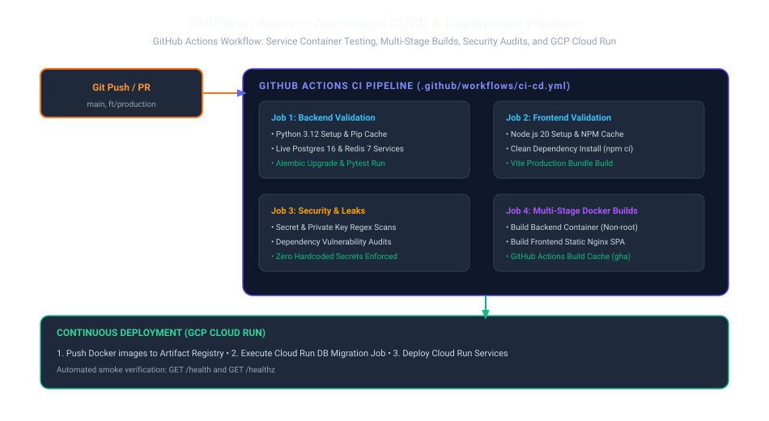

# Continuous Integration & Deployment (CI/CD)

SkillSwap Arena uses **GitHub Actions** (`.github/workflows/ci-cd.yml`) to automatically validate every pull request and build production container images on push to `main` and `ft/production`.

---

## 1. Workflow Jobs Breakdown

### Job 1: `backend-validation`
- **Environment**: Ubuntu Linux with Python 3.12.
- **Service Containers**: Boots real **PostgreSQL 16** and **Redis 7** service containers with active healthchecks.
- **Tasks**:
  1. Python bytecode compilation check (`python -m compileall app/`).
  2. Database schema migrations (`alembic upgrade head`).
  3. Pytest test suite execution across all platform domains.

### Job 2: `frontend-validation`
- **Environment**: Node.js 20.
- **Tasks**:
  1. Clean dependency installation (`npm ci`).
  2. Production Vite bundle build (`npm run build`).

### Job 3: `security-scans`
- Scans repository source for private keys, API credentials, or unescaped tokens.
- Audits dependencies against known security advisories.

### Job 4: `docker-build`
- Builds multi-stage Docker images for backend and frontend.
- Uses GitHub Actions cache (`type=gha,mode=max`) for accelerated builds.
