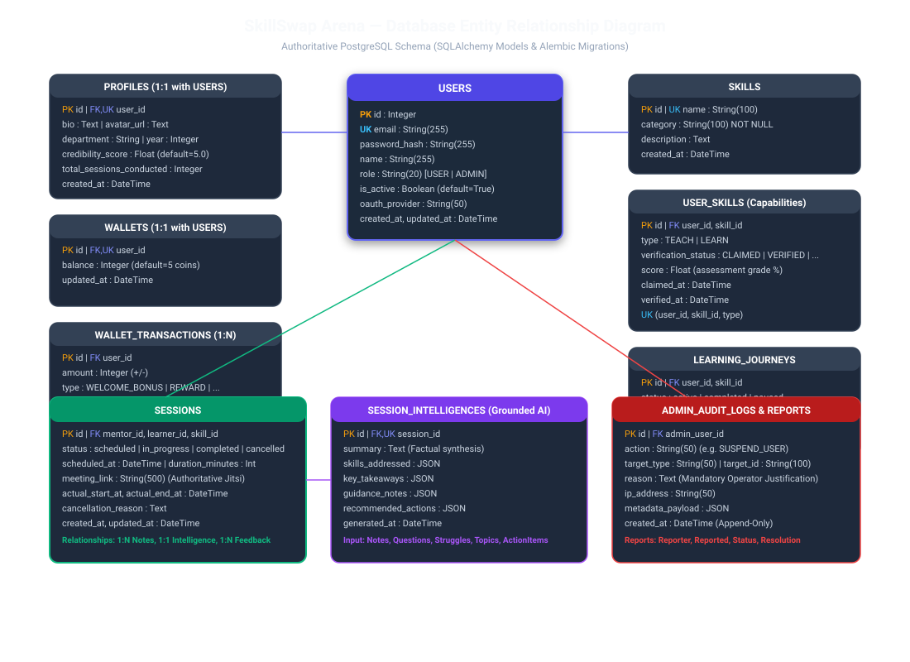

# Database Entity Relationship (ER) Diagram

This document presents the complete relational data model of SkillSwap Arena based on the active SQLAlchemy models and Alembic schema lineage.

---

## 1. Entity Catalog

### 1.1 Identity & Access
* **`users`**: Base platform accounts. Stores email, bcrypt password hash, platform `role` (`"USER"` vs `"ADMIN"`), `is_active` suspension flag, and OAuth registration provider.
* **`oauth_identities`**: Linked third-party OAuth2 accounts (Google, GitHub) storing `provider`, `provider_user_id`, and linked timestamp.
* **`profiles`**: User profile metadata (1:1 with `users`), bio, avatar URL, department, academic year, credibility score, and cumulative sessions conducted.

### 1.2 Skills, Verification & Capabilities
* **`skills`**: Master platform skill catalog (e.g. "Distributed Systems", "Cloud Architecture"). Contains name, category, and description.
* **`user_skills`**: Contextual capability links connecting a user to a skill with a `type` (`TEACH` vs `LEARN`), `verification_status` (`CLAIMED`, `VERIFIED`, `REJECTED`), and assessment test score.
* **`assessments`**: Multiple-choice assessment questions and scoring rubrics used to verify mentor capability claims.

### 1.3 Wallets & Platform Economy
* **`wallets`**: Coin ledger (1:1 with `users`), tracking available coin balance (default: 5 welcome coins).
* **`wallet_transactions`**: Immutable ledger of coin balance movements (`WELCOME_BONUS`, `REWARD`, `PENALTY`, `REFUND`, `SESSION_PAYMENT`), with unique `reference_id` for double-spend prevention.

### 1.4 Peer Learning Sessions & Real-Time Workspace
* **`sessions`**: Scheduled, active, completed, or cancelled peer sessions linking a `mentor_id`, `learner_id`, and `skill_id`. Stores authoritative Jitsi `meeting_link`, scheduled timestamp, actual start/end times, and cancellation reason.
* **`feedbacks`**: Post-session ratings (1–5 stars) and qualitative feedback, uniquely constrained by `(session_id, reviewer_id)`.
* **`mentor_availabilities`**: Mentor time slots and recurring availability definitions.
* **`session_notes`**: Real-time collaborative notes taken during a session, categorized into `NOTE`, `QUESTION`, `CONCEPT`, `STRUGGLE`, and `TAKEAWAY`.
* **`session_topics`**: Specific discussion agenda topics covered during the session.
* **`session_action_items`**: Concrete action items agreed upon by mentor and learner.
* **`session_intelligences`**: Grounded AI-synthesized intelligence record (1:1 with `sessions`) containing summary, validated skills, takeaways, guidance, and recommended next steps.

### 1.5 Learning Progress & Gamification
* **`learning_journeys`**: Student learning roadmaps toward a specific skill goal, tracking status (`active`, `completed`, `paused`) and progress percentage.
* **`learning_activities`**: Granular activity events contributing to the student's learning heatmap and analytics.
* **`achievements` & `user_achievements`**: Milestone badges and platform accomplishment awards.

### 1.6 Administration, Moderation & Auditability
* **`admin_audit_logs`**: Append-only compliance log capturing every administrative action (`action`, `target_type`, `target_id`, mandatory `reason`, operator IP address, and JSON metadata).
* **`reports`**: User-filed moderation complaints (`OPEN`, `UNDER_REVIEW`, `RESOLVED`, `DISMISSED`) with resolution notes.
