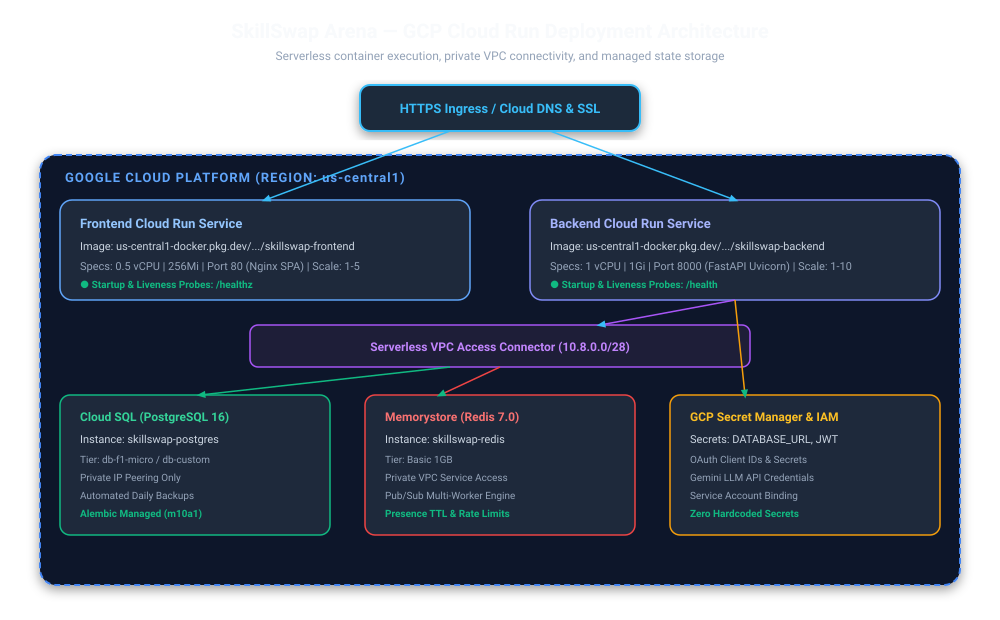

# Google Cloud Platform (GCP) Deployment Architecture

SkillSwap Arena is configured for serverless production deployment on **Google Cloud Platform (GCP)** using **Cloud Run**, **Cloud SQL**, and **Memorystore**.



---

## 1. Managed Cloud Components

| GCP Component | Resource Specification | Purpose |
| :--- | :--- | :--- |
| **Cloud Run (Backend)** | 1 vCPU, 1Gi, auto-scales 1–10 instances | Serverless FastAPI container runtime. |
| **Cloud Run (Frontend)** | 0.5 vCPU, 256Mi, auto-scales 1–5 instances | Serverless Nginx SPA container runtime. |
| **Cloud SQL** | PostgreSQL 16 (`db-f1-micro` / `db-custom`) | Managed relational database with private IP and auto-backups. |
| **Memorystore** | Redis 7.0 (Basic 1GB) | Managed low-latency cache and Pub/Sub coordinator. |
| **Serverless VPC Connector** | `skillswap-vpc-conn` (10.8.0.0/28) | Secure private bridge from Cloud Run to Cloud SQL and Memorystore. |
| **Secret Manager** | Encrypted runtime secrets | Injects `DATABASE_URL`, `SECRET_KEY`, `GEMINI_API_KEY`, OAuth tokens. |
| **Artifact Registry** | Docker Repository (`skillswap-repo`) | Stores versioned container images. |

---

## 2. Deployment Execution

### Automated Script Deployment (`deploy/gcp/deploy.sh`)
```bash
# 1. Provision Secret Manager credentials
./deploy/gcp/setup-secrets.sh YOUR_PROJECT_ID

# 2. Build images, run database migrations, and deploy to Cloud Run
./deploy/gcp/deploy.sh YOUR_PROJECT_ID us-central1
```

### Terraform Infrastructure as Code (`deploy/gcp/terraform/`)
```bash
cd deploy/gcp/terraform
terraform init
terraform plan -var="project_id=YOUR_PROJECT_ID"
terraform apply -var="project_id=YOUR_PROJECT_ID"
```
