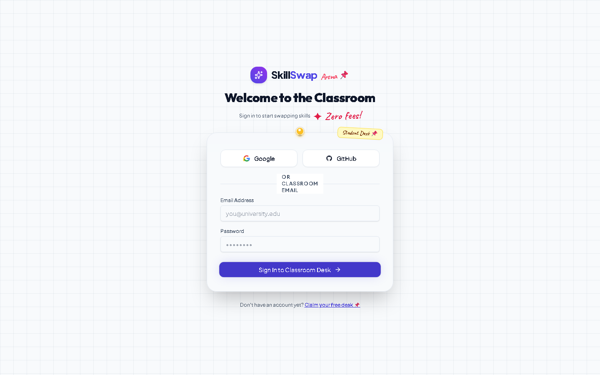
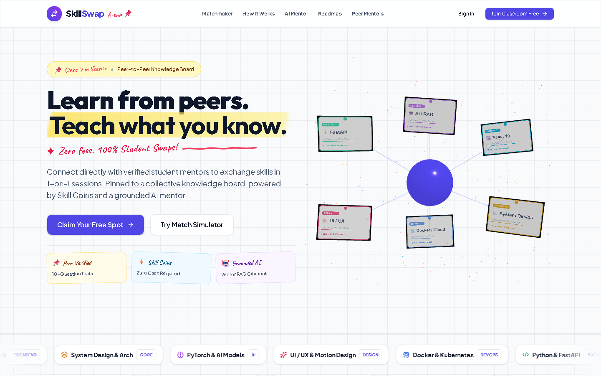

# SkillSwap Arena — Product Screenshots & Visual Showcase

All screenshots in this gallery are captured directly from the live running SkillSwap Arena production build.

---

## 1. Authentication & Onboarding

### Login Page

*Email/password authentication with bcrypt hashing, Google & GitHub OAuth single-sign-on.*

---

## 2. Student Portal & Peer Learning

### Student Dashboard

*Active sessions overview, peer requests, personalized recommendations, and activity heatmap.*

### Mentor Discovery

*Capability-verified mentor search, filterable by skill category, rating, and availability.*

### Peer Sessions Workspace

*Scheduled, active, and completed session records with quick workspace join.*

### Learning Journey & Roadmap

*Structured milestone progression and skill gap analytics.*

### AI Mentor Workspace

*Grounded 3072-dimensional vector RAG document intelligence and chat.*

---

## 3. Platform Administration Console (`/admin/*`)

### Admin Command Center

*Live KPI matrix, active system status, Three.js ambient background visualizer, and recent audit stream.*

### User Management & Capabilities

*Platform account oversight, contextual capability inspection, and audited suspensions.*

### Platform Analytics

*Live database aggregations, top teaching skills, and session completion metrics.*

### System Infrastructure & Health

*Real-time PostgreSQL query ping latency, Redis cluster status, and server uptime.*
