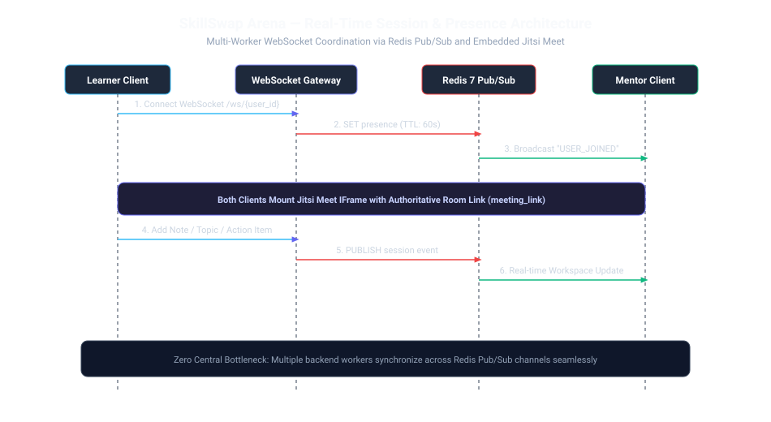

# Real-Time Presence & WebSocket Coordination

SkillSwap Arena provides real-time workspace collaboration and participant presence across multiple horizontally scaled backend instances using **WebSockets** and **Redis Pub/Sub**.



---

## 1. WebSocket Channel Architecture

- **Endpoint**: `/ws/{user_id}`
- **Authentication**: JWT token validation upon connection handshake.
- **Worker Management (`ConnectionManager`)**:
  - Tracks active `WebSocket` objects in local worker memory.
  - Supports multiple concurrent browser tabs per user account.
  - Subscribes to Redis Pub/Sub channels for cross-worker message propagation.

---

## 2. Redis Presence Heartbeats & TTL

```
1. Client connects -> SET session:presence:{session_id}:{user_id} "online" EX 60
2. Client sends periodic ping -> EXPIRE session:presence:{session_id}:{user_id} 60
3. Client disconnects / crashes -> Key expires automatically after 60s
4. Workspace presence query checks active keys in Redis
```

---

## 3. Real-Time Workspace Synchronization

When either the Mentor or Learner performs an action inside the active workspace:
- The event (`NOTE_CREATED`, `TOPIC_ADDED`, `ACTION_ITEM_UPDATED`) is dispatched over WebSocket to FastAPI.
- The service publishes the payload to Redis channel `channel:session:{session_id}`.
- All backend worker nodes hosting active connections for that session forward the event to client browsers instantly.
