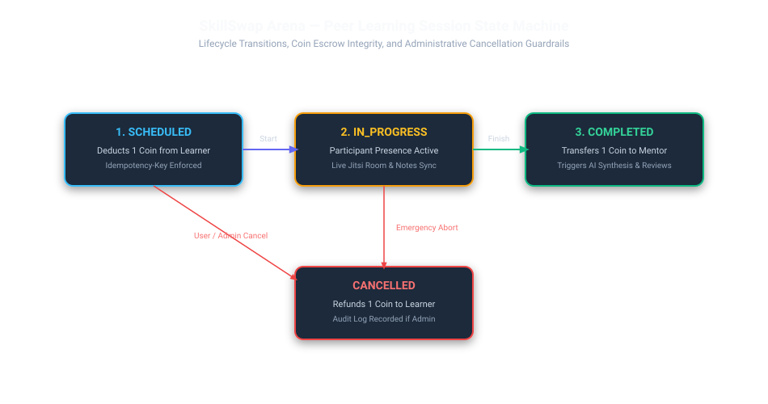

# Session Lifecycle & State Machine

SkillSwap Arena manages peer learning sessions through a strict state machine ensuring coin escrow integrity, presence verification, collaborative capture, and grounded feedback.



---

## 1. Lifecycle State Machine

A session progresses through 4 primary states:

```
[ Scheduled ] ──> [ In Progress ] ──> [ Completed ] ──> [ Feedback & Intelligence ]
      │                  │
      └───> [ Cancelled ] <──┘
```

| State | Trigger | Financial & System Actions |
| :--- | :--- | :--- |
| **`scheduled`** | Learner books session (`POST /sessions`) | Escrows 1 coin from learner wallet with `Idempotency-Key`. Generates authoritative Jitsi meeting URL. |
| **`in_progress`** | Mentor or Learner enters workspace | Sets `actual_start_at`. Activates WebSocket sync and Redis presence monitoring. |
| **`completed`** | Both parties conclude session | Sets `actual_end_at`. Transfers 1 coin to mentor wallet. Triggers AI Session Intelligence generation and unlocks feedback review. |
| **`cancelled`** | Learner, Mentor, or Admin cancels | Sets `cancellation_reason`. Issues 1 coin refund to learner wallet. Releases mentor availability slot. |

---

## 2. Transition Guardrails

1. **Double Cancellation Prevention**: Once in `completed` state, a session cannot transition to `cancelled`.
2. **Double Completion Prevention**: A completed session cannot be marked completed again.
3. **Refund Idempotency**: Cancellation refunds check for prior refund transactions (`reference_id = f"refund_session_{session_id}"`) before modifying coin ledgers.
4. **Self-Booking Rejection**: A user cannot book a session with themselves (`mentor_id != learner_id`).
